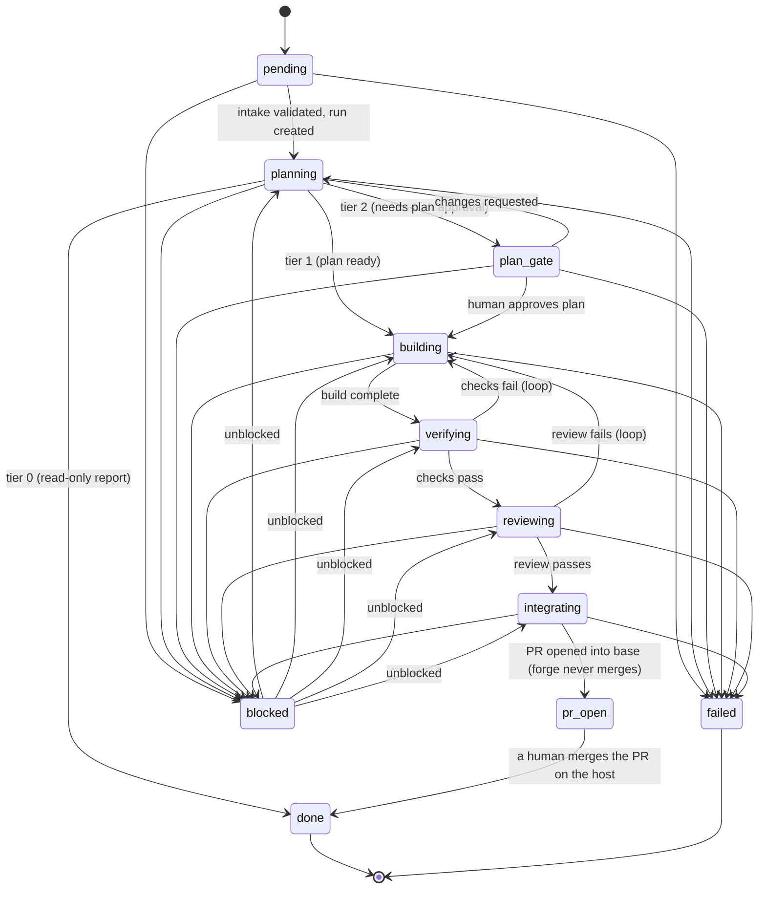

# Forge task-spec contract

This is the canonical contract for how work flows through forge. Every unit of
work, whatever its origin (a CLI prompt, a hand-written file, a GitHub issue, or
any future source), normalizes into one **task spec**. Every pipeline phase
(intake, plan, build, verify, review, integrate) reads from that spec and writes
its artifact; the launcher records the final outcome in a **run record**. Getting
this contract right keeps the phases simple; getting it wrong leaks complexity
downstream.

This contract is project-agnostic. Nothing here is specific to any single target
repository; project-specific configuration lives in each target repo's
`.forge/config.yaml` (see [project-config.md](project-config.md)), not in this
schema.

There are two distinct objects:

- **Task spec** - the (mostly immutable) definition of what is wanted. Human
  writable. One markdown file with YAML frontmatter per task.
- **Run record** - the mutable execution state for one attempt at a spec.

---

## A. Task spec

A task spec is a markdown file: **YAML frontmatter holds the structured fields,
and the body holds the free-form prose ask.** Specs live in a project's
`tasks/` directory, one file per task.

```markdown
---
id: fix-01J9Z6Q9H7K3M2N5P8R4T6V0XA
title: Retry transient HTTP 503s in the API client
type: fix
autonomy_tier: 1
acceptance_criteria:
  - 503 responses are retried up to 3 times with exponential backoff
  - A unit test covers the 503-then-200 path
---

The API client surfaces transient 503s directly to callers. Add bounded retry
with exponential backoff for idempotent requests, without changing the public
surface.
```

### Fields

The frontmatter validates against [`schema/task-spec.schema.json`](../schema/task-spec.schema.json).

#### Required

| Field                 | Type            | Description |
| --------------------- | --------------- | ----------- |
| `id`                  | string          | Stable, unique identifier. Format `<type>-<ULID-or-shorthash>` (see [Conventions](#c-conventions)). Used verbatim as the run directory name and inside the branch name, so it must be filesystem- and branch-safe (`[0-9A-Za-z]` only). The prefix must equal `type`. |
| `title`               | string          | Short human title. |
| `type`                | enum            | One of `fix`, `build`, `audit`, `refactor`, `investigate`, `chore`. |
| `autonomy_tier`       | integer enum    | `0` = read-only (no code changes, produces a report); `1` = branch + PR into base, never merges (**the default**); `2` = gated: pause for human plan approval before building. |
| `acceptance_criteria` | list of strings | Explicit, checkable list. This is exactly what **verify** and **review** test against, so each item must be concrete and verifiable, not vague. Must be non-empty. |

#### Recommended

| Field          | Type                       | Description |
| -------------- | -------------------------- | ----------- |
| `scope`        | string or list of strings  | Files, dirs, or modules likely in play, or the literal `unknown - investigate`. |
| `constraints`  | list of strings            | Invariants to preserve or things not to touch (e.g. "minimal diff", "do not change the public API"). |
| `context_refs` | list of strings            | **Pointers** to read: paths, URLs, related PRs. Never inline the content itself, only references to it. |
| `priority`     | enum                       | `P0`, `P1`, `P2`, `P3` (queue ordering; lower number is more urgent). |
| `base_branch`  | string                     | Branch the eventual PR targets. Defaults to the project's configured base (`develop`); override per task here. |
| `depends_on`   | list of task ids           | Task ids that must be merged into the base branch before this task becomes selectable by `/forge:run-all`. `/forge:run-all` defers the task until each dependency is satisfied - detected by the dependency reaching `done`, its branch landing in the base, or its PR being merged on the host. This is how tasks that touch the same files avoid colliding: the dependent waits, then branches from a base that already holds the dependency's work. |
| `source`       | object `{kind, ref}`       | Provenance. `kind` is one of `cli`, `file`, `issue`, `notion`, `slack`, `email`, `api`, `other`; `ref` is the originating URL, path, or id. |

The body (everything after the closing `---`) is the free-form prose
description of the ask. It is not schema-validated.

---

## B. Run record

A run record is the mutable execution state for **one attempt** at a spec. It
lives at `.forge/runs/<task-id>/run.json`, alongside the artifacts that phase
produces in the same directory:

```
.forge/
  queue.json                      # ingested queue: [{task_id, type, priority, status, depends_on, file}]
  runs/
    <task-id>/
      run.json                    # the run record (this object)
      context-brief.md            # produced by intake
      plan.md                     # produced by plan
      diff.patch                  # produced by build
      verify.md                   # produced by verify
      review.md                   # produced by review
      report.md                   # produced by report (tier 0)
      pr.json                     # produced by integrate
      transcript.log              # phase-by-phase execution log
```

The run record validates against [`schema/run-record.schema.json`](../schema/run-record.schema.json).

| Field           | Type                         | Description |
| --------------- | ---------------------------- | ----------- |
| `task_id`       | string                       | The `id` of the spec this run executes. |
| `attempt_n`     | integer (>= 1)               | Which attempt this is for the task. |
| `status`        | enum                         | Current state-machine state (see below). |
| `current_phase` | enum                         | Coarse pipeline phase: `intake`, `plan`, `build`, `verify`, `review`, `integrate`, `report`. |
| `branch_name`   | string or null               | Working branch (`forge/<type>/<id>`); null for tier-0 read-only runs. |
| `pr_url`        | string (uri) or null         | The opened PR, once integrate has run; null otherwise. |
| `verdict`       | object or null               | `{ result: pass|fail, reasons: [string] }` from verify/review. |
| `artifacts`     | object (name -> path)         | Known keys `intake`, `plan`, `diff`, `verdict`, `review`, `report`, `pr`, `transcript`; additional paths allowed. |
| `error`         | object or null               | `{ message, phase? }` when a phase errors. |
| `created_at`    | string (date-time)           | Run creation timestamp (ISO 8601). |
| `updated_at`    | string (date-time)           | Last update timestamp (ISO 8601). |

`status` and `current_phase` overlap by design: `status` is the precise state in
the machine below, `current_phase` is the coarse phase a human scanning the queue
cares about. Mapping:

| `current_phase` | `status` values |
| --------------- | --------------- |
| `intake`        | `pending` |
| `plan`          | `planning`, `plan_gate` |
| `build`         | `building` |
| `verify`        | `verifying` |
| `review`        | `reviewing` |
| `integrate`     | `integrating`, `pr_open` |
| `report`        | `planning` (tier-0 report in progress) |
| (terminal)      | `done`, `failed` - `current_phase` keeps its last value (`integrate` for tiers 1-2, `report` for tier 0) |
| (pause)         | `blocked` |

The state machine below is the conceptual pipeline. The forge-run workflow drives
the phases in memory and shows each transition live in the workflow view; it
persists only the **terminal or parked** state to `run.json` (via
`scripts/record-outcome.sh`): `done`, `pr_open`, `plan_gate`, `blocked`, or
`failed`. The intermediate `planning`/`building`/`verifying`/`reviewing`/
`integrating` values remain part of the contract for tooling and crash inspection.

---

## Status state machine



### Allowed transitions

| From          | To            | Trigger / condition                                   | Tiers   |
| ------------- | ------------- | ----------------------------------------------------- | ------- |
| `pending`     | `planning`    | Intake validated the spec and created the run record  | 0, 1, 2 |
| `planning`    | `plan_gate`   | Plan ready; tier 2 requires human approval first      | 2       |
| `planning`    | `building`    | Plan ready; proceed directly                          | 1       |
| `planning`    | `done`        | Read-only work finished, report written               | 0       |
| `plan_gate`   | `building`    | Human approved the plan                               | 2       |
| `plan_gate`   | `planning`    | Human requested changes; re-plan                      | 2       |
| `building`    | `verifying`   | Build complete (branch + commits exist)              | 1, 2    |
| `verifying`   | `reviewing`   | Acceptance criteria checks pass                       | 1, 2    |
| `verifying`   | `building`    | Checks fail; loop back to build                       | 1, 2    |
| `reviewing`   | `integrating` | Review passes                                         | 1, 2    |
| `reviewing`   | `building`    | Review fails; loop back to build                      | 1, 2    |
| `integrating` | `pr_open`     | PR opened into the base branch (forge never merges)   | 1, 2    |
| `pr_open`     | `done`        | A human merges the PR on the host (forge does not poll)| 1, 2    |
| any phase     | `blocked`     | Needs a human decision, credential, or access         | 0, 1, 2 |
| `blocked`     | active phase  | Human unblocked; resume the phase it paused in        | 0, 1, 2 |
| any phase     | `failed`      | Unrecoverable error                                   | 0, 1, 2 |

`done` and `failed` are terminal. `blocked` is a resumable pause, not terminal.
`pr_open` is the parked end state for tiers 1-2: **forge never merges**. The
integrate phase opens a PR into the base branch and stops there; a human reviews
and merges it on the host. forge does not poll for the merge, so for code tasks
`pr_open` is where a forge run ends; only tier-0 tasks reach `done` (their report
is written).

### Tier behavior summary

- **Tier 0 (read-only):** `pending -> planning -> done`. No branch, no build, no
  integrate, no verify/review. The artifact is `report.md`, grounded in the
  `acceptance_criteria`.
- **Tier 1 (default):** full path `pending -> planning -> building -> verifying
  -> reviewing -> integrating -> pr_open`. Opens a PR into base and parks at
  `pr_open`; a human reviews and merges it on the host.
- **Tier 2 (gated):** as tier 1, with `planning -> plan_gate -> building` so a
  human approves the plan before any code is written.

---

## C. Conventions

Other components depend on these. Keep them consistent.

### Identifiers

- Format: `<type>-<suffix>`, where the prefix equals the spec's `type` and the
  suffix is a **ULID** (26-char Crockford base32, time-sortable) or a **short
  hash** (8 to 12 hex chars of a sha256 over a normalized provenance key).
  These are conventions; the schema enforces only the `<type>-` prefix and a
  6-to-26 character `[0-9A-Za-z]` suffix.
- A ULID is preferred for fresh work; a short hash is preferred when a source
  should map deterministically to the same id so re-ingesting is idempotent.
- The id must be unique within the project and use only `[0-9A-Za-z]`, because it
  is reused verbatim as the run directory name (`.forge/runs/<id>/`) and inside
  the branch name. Id generation belongs to source-specific intake; the file
  ingester does not generate ids (specs already carry them).

### Branch naming

- `forge/<type>/<id>-<slug>` where `slug` is the lowercased title with
  non-alphanumeric runs collapsed to `-`, trimmed, and truncated (about 48
  chars). Example: `forge/fix/fix-01J9Z6Q9H7K3M2N5P8R4T6V0XA-retry-transient-http-503s`.
- Every forge branch starts with `forge/`. This is exactly why the git-safety
  guardrail's protected list (`main`, `master`, `develop`) never collides with a
  forge working branch: no forge branch can ever equal a protected branch name.
  Keep the `forge/` prefix and the protected list consistent.

### Base branch

- The integrate phase opens the PR into the spec's `base_branch` when set, else
  the project config's `vcs.pr_target`, else its `base_branch`, else `develop`.
  The per-spec override always wins; the same precedence is stated in the
  `forge-integrate` agent.

---

## D. Validation and ingestion

### Validate a spec

```
scripts/validate-task.sh path/to/task.md
```

Parses the frontmatter and checks it against the task-spec schema (required
fields, enum values, id format, non-empty `acceptance_criteria`, no unknown
fields). Prints a clear PASS/FAIL and exits non-zero on failure. Pass `--json`
as the first argument to emit the validated frontmatter as JSON (used by
ingesters).

### Ingester contract

An **ingester** turns a source into queued task specs. Whatever the source
(`cli`, `file`, `issue`, `notion`, ...), every ingester must:

1. Emit one or more task specs that **validate against
   `schema/task-spec.schema.json`** (in practice: write a `tasks/*.md` file, or
   produce an equivalent validated object).
2. Set `source.kind` / `source.ref` for provenance.
3. Register each spec into the queue at `.forge/queue.json` as a list of
   `{task_id, type, priority, status, depends_on, file}` entries (initial
   `status` is `pending`, default `priority` is `P2`, `file` is the path to
   the spec).

The reference implementation is the file ingester, the simplest possible source:

```
scripts/ingest-files.sh tasks
```

It reads `tasks/*.md`, validates each (aborting if any is invalid), and writes
`.forge/queue.json` sorted by priority then id. Future ingesters for other
sources only need to satisfy the contract above; they reuse the same schema,
validator, and queue format.

---

## Files

- [`schema/task-spec.schema.json`](../schema/task-spec.schema.json) - formal task-spec frontmatter schema.
- [`schema/run-record.schema.json`](../schema/run-record.schema.json) - formal run-record schema.
- [`examples/`](../examples/) - example specs (tier-1 fix, tier-0 audit, tier-2 build).
- [`scripts/validate-task.sh`](../scripts/validate-task.sh) - frontmatter validator.
- [`scripts/ingest-files.sh`](../scripts/ingest-files.sh) - reference file ingester.
